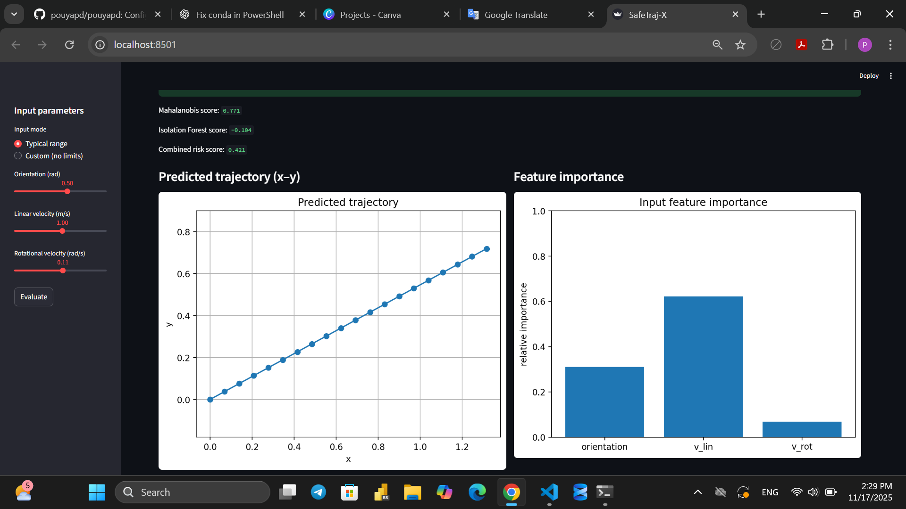
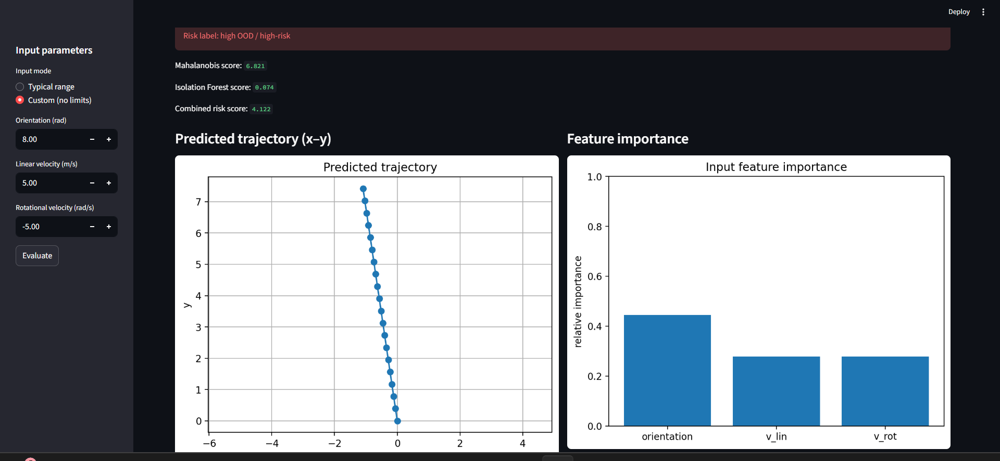
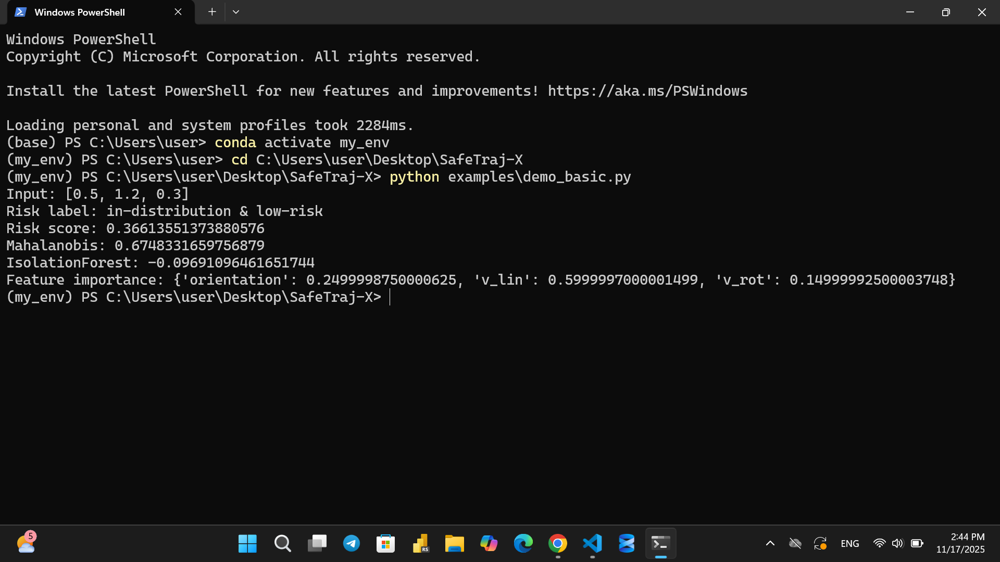

# SafeTraj — Trajectory Behaviour Analysis Toolkit

SafeTraj is a lightweight and modular Python toolkit for analysing the behaviour of pretrained neural trajectory prediction models in autonomous mobility systems.

This project focuses on trajectory-level behaviour analysis, risk estimation, and interpretability for smart wheelchairs and mobile robots.

It was developed as part of my MSc research in Artificial Intelligence at the University of Genoa, in collaboration with CNR-IEIIT within the EU Horizon Europe REXASIPRO project.

---

# Why this project?

Learning-based motion predictors can behave differently depending on input conditions such as orientation and velocity.

Understanding when and how these models fail is essential for improving reliability in safety-critical systems.

SafeTraj provides a simple and transparent environment to:

- analyse predicted trajectories
- identify unstable behaviours
- estimate trajectory-level risk
- visualise model behaviour across input conditions

The focus is on behaviour analysis, not on training new neural models.

---

# Research Focus

This toolkit investigates:

- trajectory stability under different motion commands
- failure patterns in pretrained neural predictors
- trajectory risk estimation using statistical and rule-based methods
- interpretable analysis of model behaviour

The neural models analysed were pretrained by project partners.

SafeTraj only performs behaviour analysis and does not include proprietary model weights.

---

# Features

## Trajectory Simulation

Predicts kinematic trajectories:

[x(t), y(t), θ(t)]

based on motion commands.

---

## Behaviour Analysis

Evaluates trajectory stability using:

- distance to goal
- trajectory deviation
- statistical thresholds

---

## Risk Estimation

Computes:

- risk score
- risk category (low, medium, high)

based on trajectory properties.

---

## Explainability

Provides simple feature-importance analysis showing which inputs affect trajectory risk.

---

## Interactive Dashboard

Streamlit dashboard allows:

- real-time trajectory visualisation
- interactive input control
- live risk estimation

---

# Example

Low-risk command:



High-risk command:



---

# Project Structure

dashboard/
safetraj/
trajsafe_llm/
results/
assets/

## Additional module: TrajSafe-LLM

A lightweight reporting module under [`trajsafe_llm/`](trajsafe_llm) that produces **rule-based safety labels** and *(optionally)* **local LLM explanations** via Ollama.

- CLI-friendly safety report generation  
- Optional natural-language explanation as a post-analysis layer  
- Designed for interpretability and debugging, not as a replacement for formal safety validation  

---

## 🖥 CLI Example

Example output from the command-line interface:



---

## 📦 Installation

Clone the project:

```bash
git clone https://github.com/pouyapd/SafeTraj-X.git
cd SafeTraj-X
